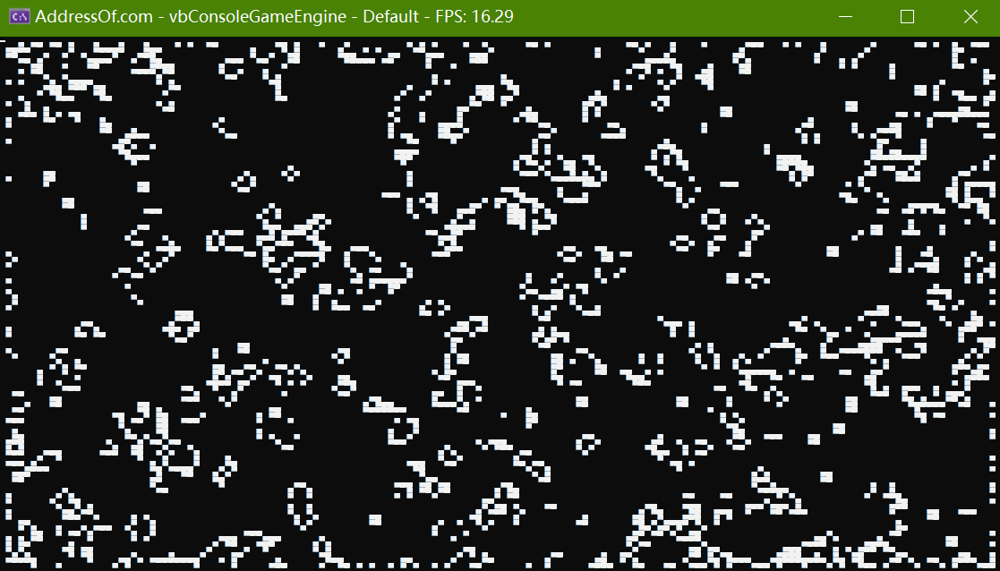

# `vbConsoleGameEngine.Extended` - A Fresh Take on Console Overutilization



## Description
This project extends `vbConsoleGameEngine` by [@DualBrain](https://github.com/DualBrain/), serving as a console-based game engine tailored for hobbyist development. Built with Visual Basic .NET, it includes a "Game of Life" demo to showcase its capabilities.

As noted by the original author, this is purely a fun project focused on "overusing" console functionality, which is definitely not intended for production use.

To run the sample, simply call `Sample.Run()` in your main subroutine after referencing the engine's DLL.

## Extended Features in `Extensions.vb`
- A `Vec2d` structure that facilitates 2D vector operations using `Double` for versatile calculations.
- A `GameMath` module that offers random number generation alongside advanced distance metrics (Minkowski, Levenshtein, and Mahalanobis distances), pushing console-based computations further.
- The above-mentioned module also includes a `CovMatrix` function to calculate the covariance matrix of a set of points, and a `Geohash` function to encode a point in 2D space into a new 2D vector.

## Prerequisites
- [.NET SDK](https://dotnet.microsoft.com/download): version 8.0 or later
- IDE: Visual Studio 2022 or Visual Studio Code

## Building the Engine
1. Clone the repository and navigate to the project directory:
``` bash
git clone https://github.com/Pac-Dessert1436/vbConsoleGameEngine.Extended.git
cd vbConsoleGameEngine.Extended
```
2. Open the solution in your preferred IDE.
3. Build via `dotnet build` - the DLL will output to `./bin/Debug/net8.0`.

## Creating a Game
1. Create a new VB.NET console project elsewhere: `dotnet new console -lang "VB"`.
2. Reference the `vbConsoleGameEngine.Extended` project or its DLL.
3. Inherit from the `ConsoleGameEngine` class.
4. Override `OnUserCreate()` to initialize game variables.
5. Implement game loop logic in `OnUserUpdate()`.
6. Run with `dotnet run` in VS Code, or via the "Run" button in Visual Studio 2022.
7. Enjoy your creation!

## License
Licensed under the MIT License. See the [LICENSE](LICENSE) file for details.